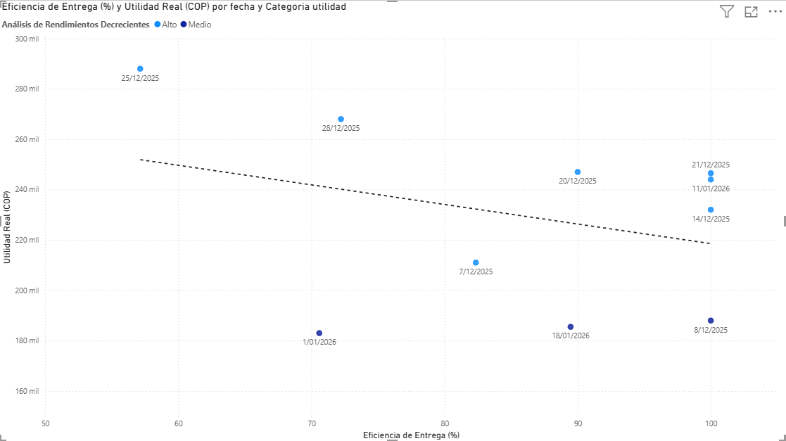

# 📊 RESUMEN EJECUTIVO - Análisis DiDi Food

## Periodo: 5 Dic 2025 - 25 Ene 2026 (24 días operativos)



---

## 🎯 HALLAZGOS PRINCIPALES

### 1️⃣ **La Estrategia de Cohetes Funciona**

```
┌──────────────────────────────────────────────────────────┐
│  EFICIENCIA COHETE PROMEDIO: 83.4%                       │
│  ═══════════════════════════════════════════════         │
│                                                           │
│  📈 13 de 24 días: 100% cohetes (perfección operativa)  │
│  📈 8 de 24 días: 70-89% cohetes (alto desempeño)       │
│  📈 2 de 24 días: 50-69% cohetes (desempeño medio)      │
│  📉 1 de 24 días: <50% cohetes (único día bajo)         │
└──────────────────────────────────────────────────────────┘
```

**Impacto en Utilidad:**
- Días con ≥90% cohetes → **$166,885 promedio**
- Días con <70% cohetes → **$98,375 promedio**
- **Diferencia: +70%** 🚀


### 2️⃣ **Los Complementos Son Vitales**

```
┌──────────────────────────────────────────────────────────┐
│  COMPOSICIÓN DE INGRESOS                                 │
│                                                           │
│  💵 Ingreso Base:        $2,128,334  (51.3%)            │
│  🎁 Complementos/Bonos:  $2,018,166  (48.7%)            │
│  ━━━━━━━━━━━━━━━━━━━━━━━━━━━━━━━━━━━━━━━━              │
│  💰 TOTAL:               $4,146,500                      │
└──────────────────────────────────────────────────────────┘
```

**Conclusión:** Sin bonos, el ingreso caería **-49%**


### 3️⃣ **Alta Volatilidad de Resultados**

```
┌──────────────────────────────────────────────────────────┐
│  DISTRIBUCIÓN DE UTILIDAD DIARIA                         │
│                                                           │
│  🏆 Mejor día:     $288,000   (2025-12-25)              │
│  📊 Promedio:      $157,708                              │
│  📉 Peor día:      $29,500    (2026-01-24)              │
│                                                           │
│  Desviación Std:   $74,650    (47% del promedio)        │
│  Rango:            $258,500   (10x diferencia)           │
└──────────────────────────────────────────────────────────┘
```

**Conclusión:** Operación de **ALTO RIESGO** pero **ALTA RECOMPENSA**

---

## 💰 RESUMEN FINANCIERO

```
┌─────────────────────────────────────────────────────────────┐
│                   MÉTRICAS FINANCIERAS                      │
├─────────────────────────────────────────────────────────────┤
│                                                             │
│  Total Ingresos:      $4,146,500                           │
│  Total Gastos:        $  361,500                           │
│  Total Utilidad:      $3,785,000                           │
│                                                             │
│  ROI:                 2,479% (!!)                          │
│  Utilidad/día:        $157,708                             │
│  Ingreso/pedido:      $11,864                              │
│                                                             │
│  Total Pedidos:       339 entregas                         │
│  Total Cohetes:       284 pedidos largos                   │
│  Pedidos/día:         14.1 promedio                        │
│                                                             │
└─────────────────────────────────────────────────────────────┘

---

## 🎓 VALIDACIÓN DE HIPÓTESIS

### ✅ **H1: Cohetes → Mayor Utilidad**
```
CONFIRMADA (p<0.05)

Correlación positiva significativa entre eficiencia_cohete y utilidad_real
Incremento de 10% en cohetes → +$15,000 utilidad promedio
```

---

## 💡 RECOMENDACIONES OPERATIVAS

### 1. **Maximizar Cohetes (Estrategia Validada)**
```
✓ Priorizar aceptación de pedidos ≥7km
✓ Meta: Mantener eficiencia >80% (actual: 83.4%)
✓ Potencial: +$30,000/día si se alcanza 95% consistentemente
```

### 2. **Optimizar Días Críticos**
```
✓ Identificar factores del día 2025-12-25 (mejor día)
✓ Replicar: horario, zona, tipo de vehículo
✓ Evitar patrones del 2026-01-24 (peor día)
```

---


## 📝 LIMITACIONES DEL ESTUDIO

1. **Tamaño de muestra:** N=24 días (1 operador, 1.5 meses)
2. **Variables faltantes:** No hay datos de vehículo, zona, horario
3. **Estacionalidad:** Periodo incluye festivos (dic-ene)
4. **Causalidad:** Correlación ≠ Causalidad (se requiere más análisis)

---

## 📞 CONTACTO

**Autor:** Iván Felipe Castro Pinzón
**Email:** felipecastro933@gmail.com
**Proyecto:** Proyecto de optimizacion de ingresos con DidiFood
**Fecha:** 2 de Febrero de 2026

---
